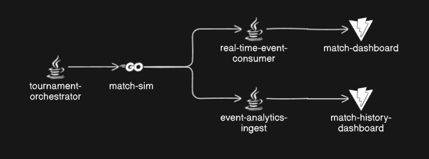

# esports-platform

## Getting Started

TODO: Instructions for running locally

This project uses Docker and Localstack to run.

## Components

### tournament-orchestrator (backlog)

A service that orchestrates matches for a tournmanet. Written in Java Spring Boot

### match-sim (in progress)

A service that simulates a valorant match and sends updates to a message broker. Written in Go w/ Lambda

### real-time-event-consumer (in progress)

A service that consumes events and delivers messages to clients in real-time. Written in Go w/ ECS

### event-analytics-ingest (backlog)

A service that ingests events from a match and stores them to provide aggregation features. Written in Java

### match-dashboard (next)

A client that displays real-time match stats. Written in Vite and Java Spring Boot

### match-history-dashboard (backlog)

A client that acts as an interface for historic tournament/match data. Written in Vite and Java Spring Boot

## Infrastructure

[DIAGRAM HERE](TODO)

### AWS Kinesis Data Stream

### Go Lambda

### Java ECS
